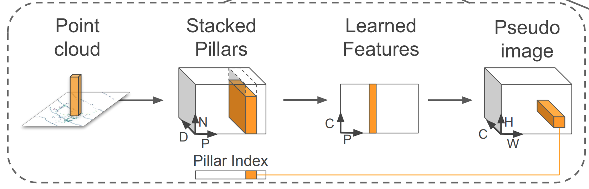

# 模型输入数据
工程中模型的输入数据是多个dict数据的集合，主要包括下面几部分：
```
eval example {0: 'voxels', 1: 'num_points', 2: 'coordinates', 3: 'rect', 
        	  4: 'Trv2c', 5: 'P2', 6: 'anchors', 7: 'anchors_mask', 
        	  8: 'image_idx', 9: 'image_shape'}
```
### 1.voxel体素数据
```
voxel(voxel_num,   # voxel的数目，每幅点云图的voxel数目都不一样
      max_points,  # 每个voxel中最大点的数目，预先设定，工程中设为100
      ndim)        # 点云数据的ndim，KITTI数据集中是4，代表x,y,z,r，即标准的KITTI点云数据格式
```
其实应该叫`pillar`数据，因为代码是继承自second，所以本文的voxel数据都可以理解为`pillar`数据，为了和工程一致，本文还是以`voxel`数据说明。
工程中通过`points_to_voxel-->_points_to_voxel_reverse_kernel`函数将KITTI点云数据points转化为voxel，其中
`_points_to_voxel_reverse_kernel`通过`numba.jit`加速。

### 2.points_to_voxel函数介绍
```
    convert kitti points(N, >=3) to voxels. This version calculate
    everything in one loop. now it takes only 4.2ms(complete point cloud) 
    with jit and 3.2ghz cpu.(don't calculate other features)
    Note: this function in ubuntu seems faster than windows 10.

    Args:
        points: [N, ndim] float tensor. points[:, :3] contain xyz points and
            points[:, 3:] contain other information such as reflectivity.
        voxel_size: [3] list/tuple or array, float. xyz, indicate voxel size
        coors_range: [6] list/tuple or array, float. indicate voxel range.
            format: xyzxyz, minmax
        max_points: int. indicate maximum points contained in a voxel.
        reverse_index: boolean. indicate whether return reversed coordinates.
            if points has xyz format and reverse_index is True, output 
            coordinates will be zyx format, but points in features always
            xyz format.
        max_voxels: int. indicate maximum voxels this function create.
            for second, 20000 is a good choice. you should shuffle points
            before call this function because max_voxels may drop some points.

    Returns:
        voxels: [M, max_points, ndim] float tensor. only contain points.
        coordinates: [M, 3] int32 tensor.
        num_points_per_voxel: [M] int32 tensor.
```
### 3.`points_to_voxel`和`_points_to_voxel_reverse_kernel`中几个重要变量说明
```
points (N, ndim)： 原始KITTI点云数据，ndim=4
voxel_size (3, )： 预先设定，代表每个voxel的尺寸，跟数据集相关，工程中是(0.16, 0.16, 4.0)
coors_range (6, )： 预先设定，代表点云数据集(x, y, z)的范围，跟数据集相关，
                    工程中是(0.0, -39.68, -3.0, 69.12, 39.68, 1.0)，代表KITTI点云数据集(x, y, z)
                    的范围是(0.0, -39.68, -3.0)~(69.12, 39.68, 1.0)
max_points： 每个voxel中最大点的数目，预先设定，工程中设为100
max_voxels： 最大voxel的数目，预先设定，工程中设为12000
grid_size (3, )： 代表体素数据被划分成的网格形状，预先设定，
				 也可以由(coors_range[3:] - coors_range[:3]) / voxel_size 计算得出，
                 工程中是(432, 496, 1)
```
**3D点云数据映射到体素数据的过程：**

先计算3D点云数据`points (N, 4)`中每个点云数据`point(4, )`映射到体素数据中的坐标`coor(3, )`。
```
c = np.floor((points[i, j] - coors_range[j]) / voxel_size[j]) (0<=i<N-1；0<=j<3)
coor[j] = c
```
上面的计算用到了`floor`函数，说明存在多个点云数据被映射到了同一个体素坐标`coor`
计算体素坐标`coor`映射到体素`voxelidx`。
```
voxelidx = coor_to_voxelidx[coor[0], coor[1], coor[2]]
```
确保`voxelidx < max_voxels`，否则直接退出循环。

把point放入相应的voxel中:
```
voxels[voxelidx, num] = points[i]
```


**从3D点云数据映射到体素数据的过程中可以得到如下结论:**
- 每个体素`voxel`中的点在空间坐标`(xyz)`中是相近的，且它们映射出的在体素数据中的坐标`coor`是一样的。
- 体素数据是稀疏的，大部分voxel只会放入几个`point`数据。

### 4.Pillar(Voxel)特征点9维数据计算方式
```
[x, y, z, r,  x_c, y_c, z_c,  x_p, y_p]
```
```
(x, y, z, r):    原始point(点云)4维数据。

(x_c, y_c, z_c): 该点云所处pillar中所有点的几何中心。
				 pillar几何中心就是每个pillar中，所有point每个维度坐标的均值。
                 
(x_p, y_p):      每个pillar中point相对于网格中心的偏差。
```
其中网格中心是二维数据，是通过体素数据坐标`coor`计算出来的，如下所示:
```
x_sub = coors_x.unsqueeze(1) * 0.16 + 0.08
y_sub = coors_y.unsqueeze(1) * 0.16 - 39.6
```
### 5.网络输入数据`Tensor(D, P, N)`

每个`pillar`中对多余`N`的进行采样，少于`N`的进行补0，于是就形成了`(D, P, N)`的Tensor
`D`是特征维度等于9，`P`是xy二维平面`pillar`数目`HxW`
（实际代码中进行卷积的`P`等于`voxel_num`，最后需要reshape成`HxW`），
`N`是每个`pillar`采样点数目，工程中等于`100`。


---

# 网络结构

### 1. PillarFeatureNet (PFN)

用于将网络输入Tensor(D, P, N)通过特征提取转换为伪二维特征图片(Pseudo image)。



#### 代码结构

卷积提取特征:

```
def forward(self, input):
    x = self.conv1(input)
    x = self.norm(x)
    x = F.relu(x)
    x = self.conv3(x)
    return x
```
要点:
- 用卷积代替max pooling。
- 得到voxel_features维度是`(batch, 64, voxel_num, 1)`。
- PointPillarsScatter做reshape，把voxel_features转换为伪二维特征图片。

```
def forward(self, voxel_features, coords):
    # batch_canvas will be the final output.
    batch_canvas = []
    first_canvas = torch.zeros(self.nchannels, self.nx * self.ny, dtype=voxel_features.dtype,
                                device=voxel_features.device)
                                
    # Only include non-empty pillars
    first_batch_mask = coords[:, 0] == 0
    first_this_coords = coords[first_batch_mask, :]
    first_indices = first_this_coords[:, 2] * self.nx + first_this_coords[:, 3]
    first_indices = first_indices.type(torch.long)
    first_voxels = voxel_features[first_batch_mask, :]
    first_voxels = first_voxels.t()

    # Now scatter the blob back to the canvas.
    first_canvas[:, first_indices] = first_voxels

    # Append to a list for later stacking.
    batch_canvas.append(first_canvas)

    # Create the canvas for this sample
    second_canvas = torch.zeros(self.nchannels, self.nx * self.ny, dtype=voxel_features.dtype,
                                device=voxel_features.device)

    second_batch_mask = coords[:, 0] == 1
    second_this_coords = coords[second_batch_mask, :]
    second_indices = second_this_coords[:, 2] * self.nx + second_this_coords[:, 3]
    second_indices = second_indices.type(torch.long)
    second_voxels = voxel_features[second_batch_mask, :]
    second_voxels = second_voxels.t()

    # Now scatter the blob back to the canvas.
    second_canvas[:, second_indices] = second_voxels

    # Append to a list for later stacking.
    batch_canvas.append(second_canvas)

    # Stack to 3-dim tensor (batch-size, nchannels, nrows*ncols)
    batch_canvas = torch.stack(batch_canvas, 0)

    # Undo the column stacking to final 4-dim tensor
    batch_canvas = batch_canvas.view(2, self.nchannels, self.ny, self.nx)
    return batch_canvas
```

### 2. Backbone& Detection Head
- backbone用的就是RPN。
- 卷积和反卷积的组合，在channel方向将其concat。
- 分为top-down network产生空间分辨率逐步降低的fmap。
- deconv做upsample和concatenation,精细化feature。

代码如下:

```
def forward(self, x, bev=None):
    x = self.block1(x)
    up1 = self.deconv1(x)
    if self._use_bev:
        bev[:, -1] = torch.clamp(
            torch.log(1 + bev[:, -1]) / np.log(16.0), max=1.0)
        x = torch.cat([x, self.bev_extractor(bev)], dim=1)
    x = self.block2(x)
    up2 = self.deconv2(x)
    x = self.block3(x)
    up3 = self.deconv3(x)
    x = torch.cat([up1, up2, up3], dim=1)
    box_preds = self.conv_box(x)
    cls_preds = self.conv_cls(x)
    # [N, C, y(H), x(W)]
    box_preds = box_preds.permute(0, 2, 3, 1).contiguous()
    cls_preds = cls_preds.permute(0, 2, 3, 1).contiguous()
    # ret_dict = {
    #     "box_preds": box_preds,
    #     "cls_preds": cls_preds,
    # }
    ret_tuple = (box_preds, cls_preds)
    if self._use_direction_classifier:
        dir_cls_preds = self.conv_dir_cls(x)
        dir_cls_preds = dir_cls_preds.permute(0, 2, 3, 1).contiguous()
        # ret_dict["dir_cls_preds"] = dir_cls_preds
        ret_tuple += (dir_cls_preds,)
    # return ret_dict
    return ret_tuple

```


最后返回一个tuple的`preds_dict`。
```
box_preds (batch, h, w, num_anchor_per_loc * box_code_size) # box_code_size=7
```
`fmap`每个点回归出2个框，每个框7个参数，分别为`(x, y, z, w, l, h, r)`。
```
cls_preds (batch, h, w, num_cls)
```
`fmap`每个点回归出`num_cls`个类别预测。
```
dir_cls_preds (batch, h, w, num_anchor_per_loc * 2)
```
`fmap`每个点回归出2个框，每个框2个方向。


---

>本说明整理至知乎网友[硅仙人](https://www.zhihu.com/people/wang-ji-chen)的文章：[代码层面解读3D点云物体检测模型：PointPillars](https://zhuanlan.zhihu.com/p/357713061)。
